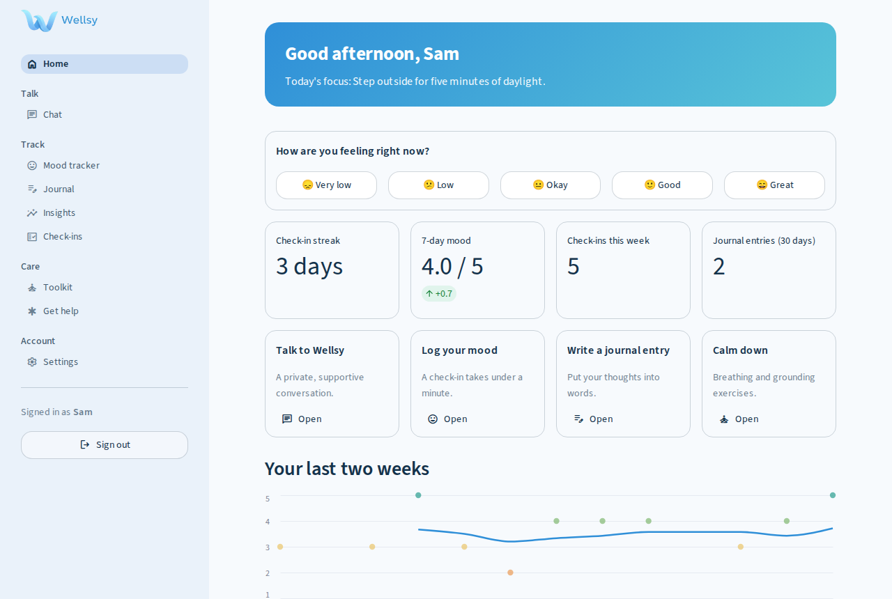
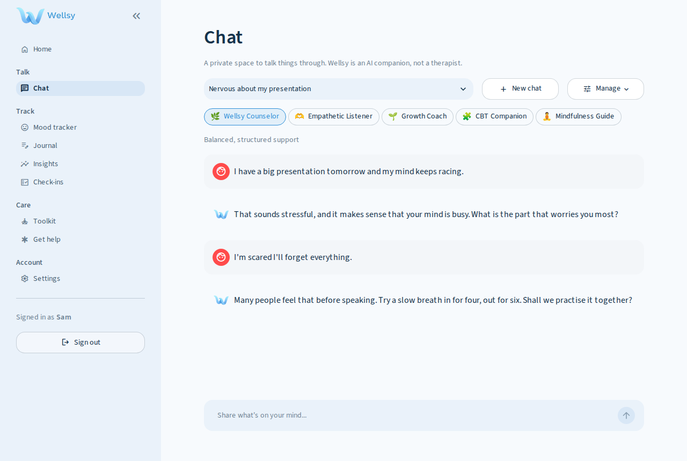
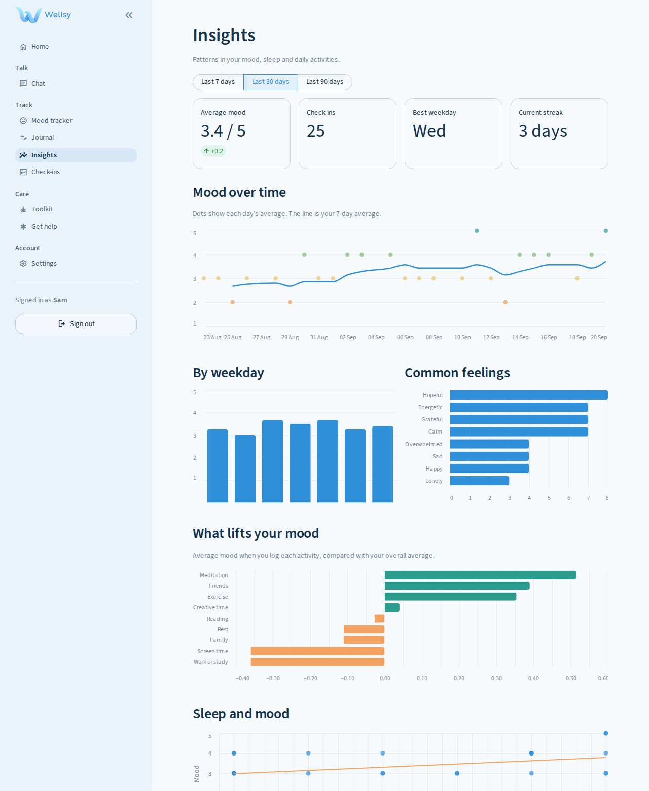
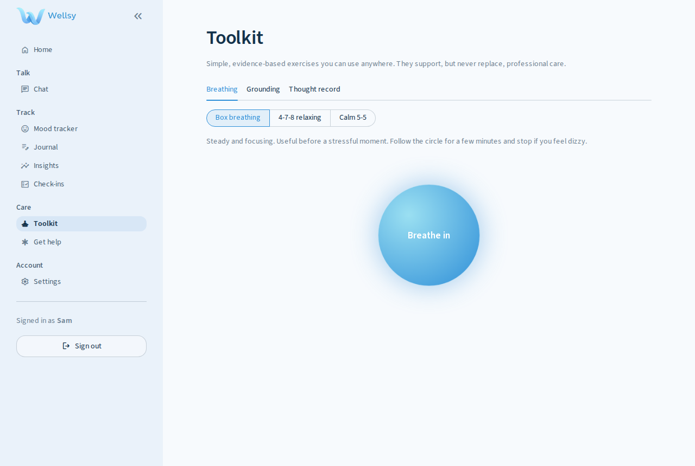
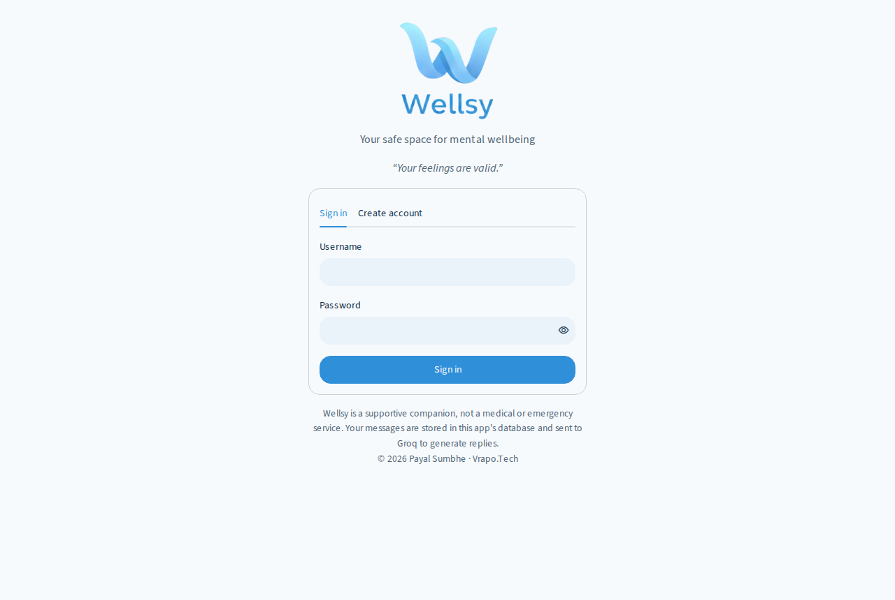
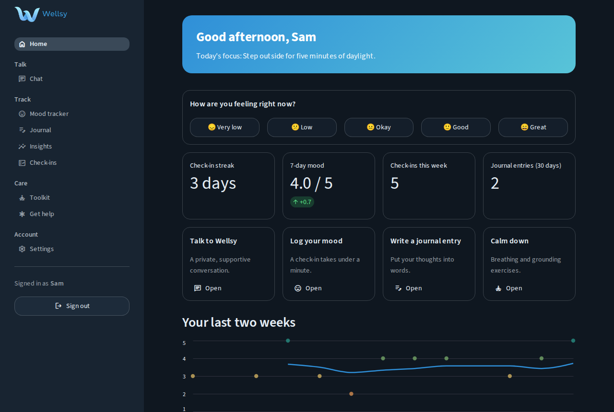
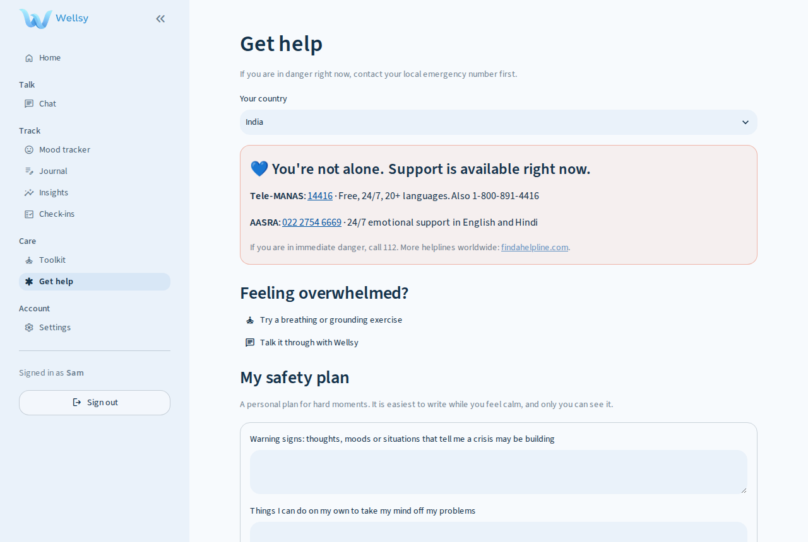

# Wellsy: AI Mental Health Companion

A private, supportive space to talk things through, track your mood, write, and learn calming skills, with safety built in from the start.

**Live app:** https://wellsy.streamlit.app/

| | |
|---|---|
|  |  |
|  |  |

<details>
<summary>More screenshots</summary>





</details>

> Wellsy is a supportive companion. It is not a medical device, a therapist, or an emergency service.

## Features

**Talk**
- Multiple saved conversations that can be renamed, exported and deleted, with automatic titles.
- Five personas: Wellsy Counselor, Empathetic Listener, Growth Coach, CBT Companion and Mindfulness Guide.
- Streaming replies. Optional personalisation from a short summary of your recent mood, check-in scores and journal tags (can be switched off).

**Track**
- **Mood tracker:** mood, feelings, activities, sleep and a short note.
- **Insights:** 7, 30 or 90 day views with trend and 7-day average, weekday pattern, common feelings, what lifts your mood, sleep against mood and a calendar heatmap.
- **Journal:** writing prompts, tags, search, editing and an optional AI reflection.
- **Check-ins:** PHQ-9 and GAD-7 questionnaires with score history.
- **Summary for a professional:** a plain-language report and CSV you can download and share.

**Care**
- **Toolkit:** guided breathing (box, 4-7-8, 5-5), 5-4-3-2-1 grounding, and a CBT thought record with an optional AI reframe.
- **Get help:** helplines for India, USA, UK, Canada and Australia, plus a personal safety plan modelled on the Stanley-Brown steps.

**Account**
- bcrypt password hashing, sign-in lockout after repeated failures, per-user data isolation.
- Download all your data as JSON, or delete your account and everything in it.

## Safety and privacy

- Risk language (English plus a few Hinglish phrases) in chat, journal, mood notes and thought records shows helplines immediately. This keyword check is a backstop alongside the AI's own safety rules, not a substitute for them.
- PHQ-9 item 9 always shows helplines when answered above zero.
- Helplines were checked against official sources in September 2026. Please re-verify them periodically (`core/safety.py`).
- What is stored: your account, chats, journal, check-ins and safety plan, in the app's SQLite database.
- What leaves the app: chat messages, journal reflections you request, and (if enabled) a short summary of your recent mood, check-in scores and journal tags are sent to [Groq](https://groq.com) to generate replies. The summary carries entry counts, scores and journal tags, never full journal text. Nothing else is shared, and there is no analytics tracking.

## Getting started

Requires Python 3.11 or newer.

```bash
git clone https://github.com/payalrvs3/Wellsy-AI-Mental-Health-Companion.git
cd Wellsy-AI-Mental-Health-Companion
pip install -r requirements.txt
cp .env.example .env        # add your GROQ_API_KEY
streamlit run app.py
```

Want to look around with sample data first? Run `python -m scripts.seed_demo`, then sign in with `demo` / `demo-password`.

### Configuration

| Variable | Default | Purpose |
|---|---|---|
| `GROQ_API_KEY` | none | Enables chat, journal reflections and reframes. |
| `WELLSY_MODEL` | `openai/gpt-oss-120b` | Any chat model available to your Groq account. Groq retires models over time, so check [their deprecations page](https://console.groq.com/docs/deprecations). |
| `WELLSY_DB` | `data/wellsy.db` | Location of the SQLite database. |

## Deployment

- **Streamlit Community Cloud:** add `GROQ_API_KEY` under *Secrets*. Its filesystem is not persistent, so accounts and chats are lost when the app restarts. Use it for demos only.
- **Docker (recommended for real use):**
  ```bash
  docker build -t wellsy .
  docker run -p 8501:8501 -e GROQ_API_KEY=your-key -v wellsy-data:/data wellsy
  ```
  The volume keeps the database between restarts.

## Project structure

```
app.py            Entry point: page setup, sign-in gate, navigation
core/
  db.py           SQLite, migrations and user-scoped helpers
  auth.py         Registration, sign-in, lockout, account deletion
  ai.py           Groq client, personas, streaming and one-shot replies
  safety.py       Helplines and risk-language check
  stats.py        Mood analytics with pandas
  charts.py       Altair charts
  content.py      Prompts, questionnaires and other static content
  ui.py           Theme CSS and shared components
views/            One file per page
scripts/          Demo data seeding
tests/            pytest suite
```

## Development

```bash
pip install -r requirements-dev.txt
ruff check . && ruff format --check .
pytest
```

The tests cover the database, authentication, safety checks, analytics, the AI layer (with a fake client) and every page.

## Roadmap

- Hosted database for persistent cloud deployment.
- Stay signed in across browser refreshes.
- Reminders for daily check-ins.
- More languages and more countries' helplines.

## Credits

The PHQ-9 and GAD-7 questionnaires were developed by Drs. Spitzer, Williams, Kroenke and colleagues and are free to use. Licensed under the [MIT License](LICENSE). Built by Payal Sumbhe, Vrapo.Tech.
